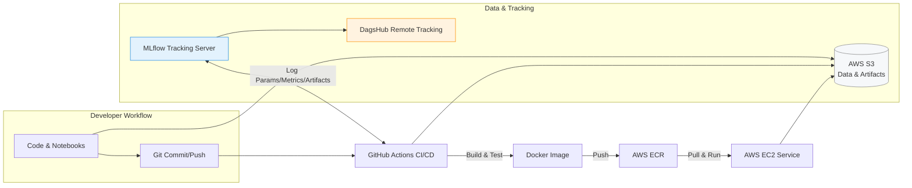

#  Network Security – Phishing Website Detection 🔍

<p align="center">
  
  
  
  
  
  
  
</p>

A complete end-to-end **Machine Learning** project that detects phishing websites using supervised learning.  
It features a clean pipeline architecture, **experiment tracking with MLflow & DagsHub**, containerized packaging, and cloud-ready deployment.

---

## 🧭 Problem Statement

Phishing websites impersonate trusted brands to steal credentials and financial data. Rule-based filters struggle against **fast-evolving** attacks and novel domains.

**Why AI solves this:**  
- Learns **patterns** from large URL & page-level features (not just static rules).  
- Generalizes to **previously unseen** phishing sites.  
- Continuously improves with **tracked experiments** and retraining.

---

## 📦 Dataset

- **Name:** Phishing Website Detection Dataset  
- **Source:** [Kaggle – Phishing Website Detection](https://www.kaggle.com/datasets/sid321axn/phishing-website-detector)  
- **Format:** CSV  
- **Features:** 30+ web attributes (e.g., URL length, SSL state, domain age)  
- **Target Variable:** `Result`  
  - `-1`: Phishing  
  - `1`: Legitimate  

---

## 🗂 Project Structure (Main Skeleton)

> This is the **main structure**; the production codebase contains **additional modules/configs** beyond this outline.

```bash
networksecurity/
├── data/                 # Raw + processed data
├── notebooks/            # Jupyter notebooks for exploration
├── networksecurity/      # Core pipeline modules
│   ├── components/       # Data ingestion, transformation, training
│   ├── pipeline/         # Training & evaluation pipelines
│   ├── utils/            # Helper functions
│   ├── logger/           # Custom logging
│   ├── exception/        # Error handling
│   └── app.py            # (Optional) API layer for inference
├── config/               # Config files (YAML)
├── final_models/         # Trained models
├── mlruns/               # MLflow experiments
├── requirements.txt
├── main.py               # Pipeline runner
└── README.md
```
---

## 🧱 Features & Stack

| Feature                   | Technology Used                                |
| ------------------------- | ---------------------------------------------- |
| Data Handling             | `pandas`, `numpy`                              |
| Modeling                  | `scikit-learn` (LogReg, RF), `xgboost`         |
| Tracking & Versioning     | `MLflow` (local/remote), `DagsHub`             |
| Pipeline Architecture     | Modular, OOP-based                             |
| Deployment (API Service)  | `app.py` service, Dockerized, cloud-ready      |
| Model Evaluation          | Accuracy, Precision, Recall, F1-Score, ROC-AUC |

---

## 🏗️ Infrastructure (Live Diagram)

**Workflow Overview**  
- **Storage:** AWS S3 (data, artifacts, models)  
- **Tracking:** MLflow (experiments, metrics) + DagsHub (remote tracking)  
- **Deployment:** Docker image → AWS ECR → AWS EC2 (serving)  
- **Automation:** GitHub Actions for CI/CD (build, test, tag, push)  
- **Observability:** Custom `logger/` + `exception/` modules  

# 🚀 Live Pipeline Diagram


  
---
---

## 🔁 ML Pipeline Stages

1. **Data Ingestion**  
2. **Data Validation** (schema, nulls, ranges)  
3. **Data Transformation** (feature engineering, scaling/encoding)  
4. **Model Training** (Logistic Regression, XGBoost, Random Forest)  
5. **Model Evaluation** (metrics + artifacts logged to MLflow)  
6. **Model Pushing** (saved locally and/or to AWS S3)  

flowchart TD
    A[Data Ingestion] --> B[Data Validation<br/>(schema, nulls, ranges)]
    B --> C[Data Transformation<br/>(feature eng., scaling, encoding)]
    C --> D[Model Training<br/>(LogReg, XGBoost, RandomForest)]
    D --> E[Evaluation<br/>Accuracy/Precision/Recall/F1/ROC-AUC]
    E --> F[MLflow Logging<br/>params, metrics, artifacts]
    F --> G[Model Registry/Artifacts<br/>S3 + mlruns/]
    G --> H[(Optional) API Serving<br/>Docker on EC2]
 

---

## 📒 MLflow Integration

- Each pipeline step logs **parameters, metrics, and artifacts** to MLflow.  
- Runs can be tracked:  
  - **Locally** → `mlruns/` folder  
  - **Remotely** → DagsHub (via MLflow env vars)  
- Facilitates **model comparison, reproducibility, and rollbacks**.  

---

## 🧪 Model Performance (Illustrative)

| Model               | Accuracy | Precision | Recall | F1-Score | ROC-AUC |
|----------------------|----------|-----------|--------|----------|---------|
| Logistic Regression  | 91%      | 90%       | 89%    | 89%      | 0.93    |
| XGBoost              | 94%      | 93%       | 92%    | 92%      | 0.96    |
| Random Forest        | 96%      | 95%       | 96%    | 95%      | 0.98    |

**Why Recall matters:**  
⚠️ Missing a phishing site (**false negative**) is riskier than a false positive.  
👉 **Random Forest** was chosen for the best Recall/F1 balance.  

---

## 🧰 How to Run

```bash
# Clone repository
git clone https://github.com/yourusername/networksecurity.git
cd networksecurity

# Create & activate environment
python -m venv venv

# Windows
venv\Scripts\activate

# macOS/Linux
source venv/bin/activate

# Install dependencies
pip install -r requirements.txt

# Run the end-to-end pipeline
python main.py

# Inspect MLflow experiments locally
mlflow ui   # open http://127.0.0.1:5000

```


## 🔗 Remote Tracking (DagsHub)
- Set **MLflow environment variables** for remote tracking  
- Skip `mlflow ui` when using DagsHub  

## ☁️ Cloud & Deployment (Optional API)

- **Artifacts & Models**: stored in **AWS S3**  
- **Container Image**: built with **Docker**, pushed to **AWS ECR**  
- **Serving**: pull & run on **AWS EC2**  
- **CI/CD**: automated with **GitHub Actions**  
- **API**: `networksecurity/app.py` exposes inference endpoints  

## 🔮 Future Improvements

- ✅ **Explainability (SHAP)** → feature contribution & analyst trust  
- ✅ **Streamlit Dashboard** → live insights & SOC analyst workflows  
- ✅ **Threat Intel Feeds** → enrich predictions (OpenPhish / PhishTank)  
- ✅ **LLM-assisted Triage** → natural language rationale for SOC teams  
- ✅ **Unit & Integration Tests** → higher coverage & reliability  
- ✅ **Infra as Code** → Terraform + AWS Secrets Manager  

## 👤 Author
**Adebayo Gabriel** – ML Engineer (**AI × Cybersecurity**)  

## 🔗 Links 
📧 iyanuoluwaadebayo04@gmail.com | 🌐 [LinkedIn](https://www.linkedin.com/in/gabriel-adebayo-2a0ba2281) | [GitHub](https://github.com/iyan-coder)  

---

⚡ *This is more than a model—it's a production-minded AI system for real-world network security.*
